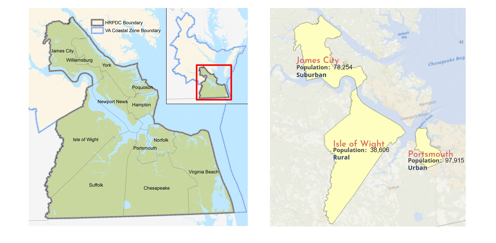
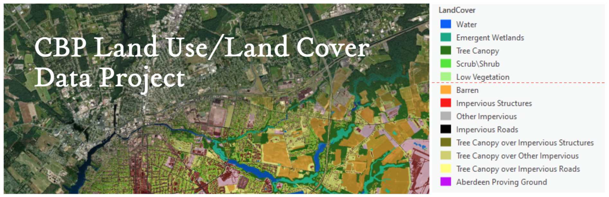
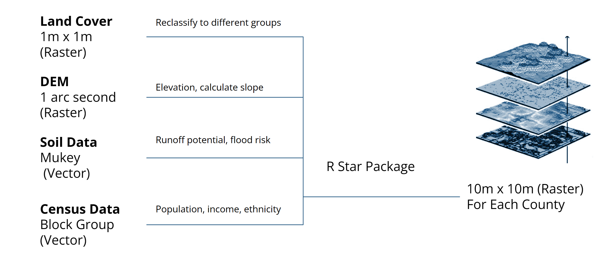
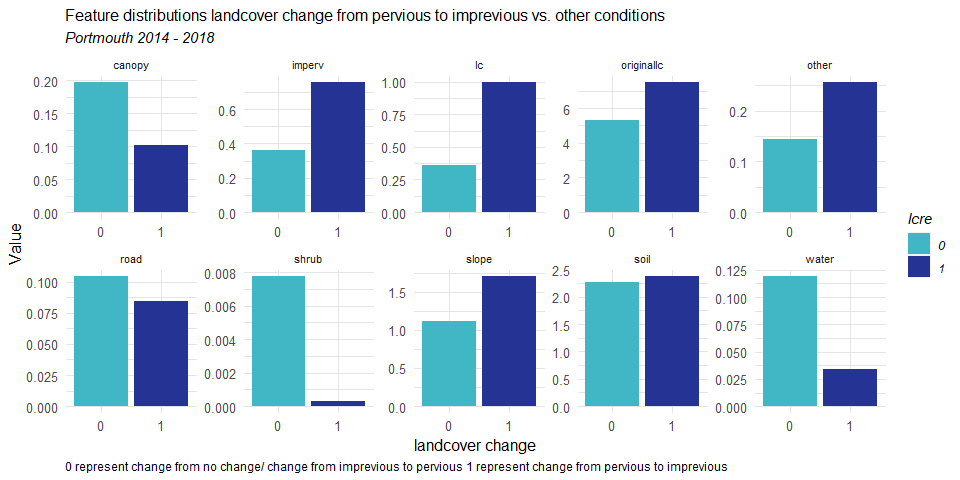
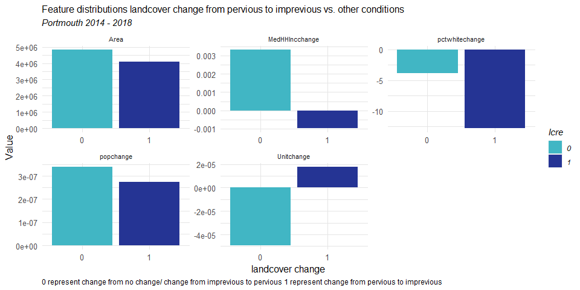

```{r setup, include=FALSE}
knitr::opts_chunk$set(echo = TRUE)
```

[Return to MUSA 801 Projects Page](https://pennmusa.github.io/MUSA_801.io/)

This project was completed for the MUSA/Smart Cities Practicum course (MUSA 801) instructed by Michael Fichman and Matthew Harris. We are grateful to our instructors for their continued support and feedback. We would like to give special thanks to KC Filippino and Ben McFarlane from Hampton Roads Planning District Commission, and Dexter Locke from the United States Forest Service for providing data, insight, and support throughout the semester. This project would not have been possible without them.

[View Dashboard](https://yuewendai.github.io/MUSA-Practicum-Web/)

## 1.Introduction
### 1.1 Abstract
This project aims to develop a precision forecast model for land cover change at the Chesapeake Watershed. By leveraging high-resolution longitudinal land cover data provided by the Chesapeake Conservancy, the model will predict land cover conversions from pervious to impervious surfaces. This forecast will enable land use and environmental planners to identify where urban growth will occur, propose green infrastructure accordingly, and prioritize lands for protection. The model will be generalizable to the county level, incorporating only widely available inputs, thus allowing any municipality within the Chesapeake basin to replicate the analysis. This proof-of-concept project will demonstrate the utility of precision conservation in land protection and green infrastructure planning and provide a valuable tool for planners and policymakers across the region.

### 1.2 Background 
The Chesapeake Bay watershed is an ecologically and economically significant resource, encompassing diverse ecosystems and supporting a multitude of industries, including agriculture, tourism, and fisheries. However, the region is facing increasing environmental challenges due to the combined effects of sea-level rise and land subsidence. As a result, the area has become the second-most vulnerable region in the nation to flooding and storm surge, only after New Orleans. Predicting land cover changes, particularly the conversion from pervious to impervious surfaces, is crucial in addressing these challenges and informing climate adaptation and mitigation planning.

Our project focuses on three distinct counties within the Chesapeake Bay watershed, representing varying development contexts. Portsmouth is the urban prototype characterized by its dense residential, commercial, and industrial areas. James City County exemplifies a suburban context, with a mix of rural, suburban, and urban development and a diverse landscape encompassing forests, wetlands, and historic sites. Lastly, Isle of Wight County represents the rural aspect, predominantly characterized by agriculture, forestry, and extensive natural habitats. By considering these diverse counties, we can develop a comprehensive and generalizable model to predict land cover changes across various regional development scenarios.




### 1.3 Motivation & Use Case

To build resilient communities, the HRPDC has set up a green infrastructure plan. This plan aims to to identify and prioritize a network of valuable conservation lands in order to achieve multiple benefits, such as habitat protection, drinking water supply protection, stormwater management and recreational opportunities. A new component of this plan is to build a model for the potential future growth and identify which areas of the green infrastructure network are most at risk for development.

[Green Infrastructure Plan for Hampton Roads Region](https://www.hrpdcva.gov/departments/planning/green-infrastructure-plan-for-hampton-roads-region/)

## 2. Data and Methods

### 2.1 Understanding landcover data
The Chesapeake Conservancy supplies us with high-resolution landcover data at 2013/14 and 2017/18 , which is essential for our precision conservation efforts. This data is a vast raster dataset with an impressive 1-meter accuracy, offering 900 times more detail than the commonly used 30-meter resolution National Land Cover Dataset. This level of detail is critical in capturing subtle changes in land use and land cover. Within the landcover classification, pervious surfaces include categories such as tree canopy, shrub, and wetlands, which allow water to infiltrate the ground, while impervious surfaces encompass categories like roads and structures that prevent water infiltration, leading to increased runoff and potential flooding issues. This detailed classification enables us to better understand and predict land cover changes, particularly the conversion from pervious to impervious surfaces.



[Data Source](https://www.chesapeakeconservancy.org/conservation-innovation-center/high-resolution-data/lulc-data-project-2022/)


### 2.2 Ohter data
To understand how landcover change is affected by other environmental, social and economical factors, we also acquire data from the following source: 

* [DEM ( 1 arc-second) from USGS](https://apps.nationalmap.gov/downloader/)

* [Soil Data from the Web Soil Survey](https://websoilsurvey.nrcs.usda.gov/app/)

* census tract-level data (2014, 2018, 2021) from four years of the American Community Survey (ACS) 

### 2.3 Unit of analysis
To make it easier for our future analysis, we gathered and resampled all data to 10 x 10 meters resolution as the basic analysis unit to ensure consistency.




## 3. Exploratory Analysis

### 3.1 Enviornmental Factors




Take Portsmouth county as example, we find that landcover change from pervious to impervious tend to happens at in where has less canopy area, far away from water, and slope is steeper.


### 3.2 Social and Economical Factors



### 3.3 Feature engineering


#### dependent: pervious to impervious surface during the period 2014-201
#### independent:
    lccover change 能change
    1. `originallc` originallandcover
    
    2. `lcp` permeable/impermeable:
    < 6 - 0
    >= 6 - 1
    
    3. `lcchange` whether landcover has changed: 1
    
    4. `lc` 3*3的permeable rate:
    0-1（0.1，0.2， 0.3， 0.4， 0.5， 0.6， 0.7， 0.8）
    
    5. `popchange` per m^2
    
    6. `pctwhitechange`
    
    7. `unitchange` per m^2
    
    8. `medhhincchange` per m^2
    
    9. `road` road 1/0
    
    10. `water` water
    
    11. `canopy` tree canopy：
    tree canopy - 1
    tree canopy over structure -0.5
    tree canopy over other -0.5
    tree canopy over road - 0.5
    other - 0
    
    12. `perm` permeable:
    2 -shrub - 0.3
    4 - herb - 0.3
    5 - wetand - 0.4
    other -0
    
    13. `barren` barren:
    6 - barren - 1
    not barren - 0
    
    14. `struct` structure:
    7 - structure - 1
    not structure - 0
    
    15. `other` other:
    8 - other - 1
    not other - 0
    
    16. `terrain`dem
    
    17. `slope`slope
    
    18. `area` m^2 per block group
    
    19. `geoid`-- blockgroup id
    
    20. `soil type`-


模型encode：categorial：尤其是

possible features per 10*10 :

Road density
**distance to rivers**

impervious / pervious
landcover type
population density
population change per 4 year
median hh income
median hh income change per 4 year
percentage of white population
percentage of white population change per 4 year
percentage of changing from impervious to pervious/from pervious to impervious in 4 years
predicted landcover type:

possible features per block group :

percentage of impervious / pervious change:
population
population change per 4 year
median hh income
median hh income change per 4 year
percentage of white population
percentage of white population change per 4 year
percentage of changing from impervious to pervious/from pervious to impervious in 4 years
predicted landcover type composition:

possible feautres per county:

percentage of impervious / pervious change:
population
population change per 4 year
median hh income
median hh income change per 4 year
percentage of white population
percentage of white population change per 4 year
percentage of changing from impervious to pervious/from pervious to impervious in 4 years
predicted landcover type composition:
development speed defined by: speed of population change and landcover change speed
Agricultural land use, vegetation cover and water loss:


## 4. Modeling & Evaluation

### 4.1 Enviornmental Factors


## 5. Conclusion

## 6. Code Appendix
