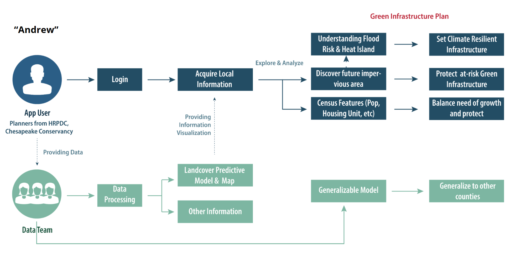
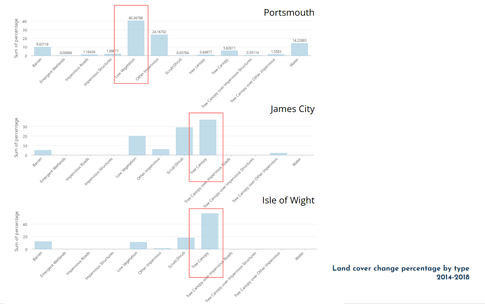
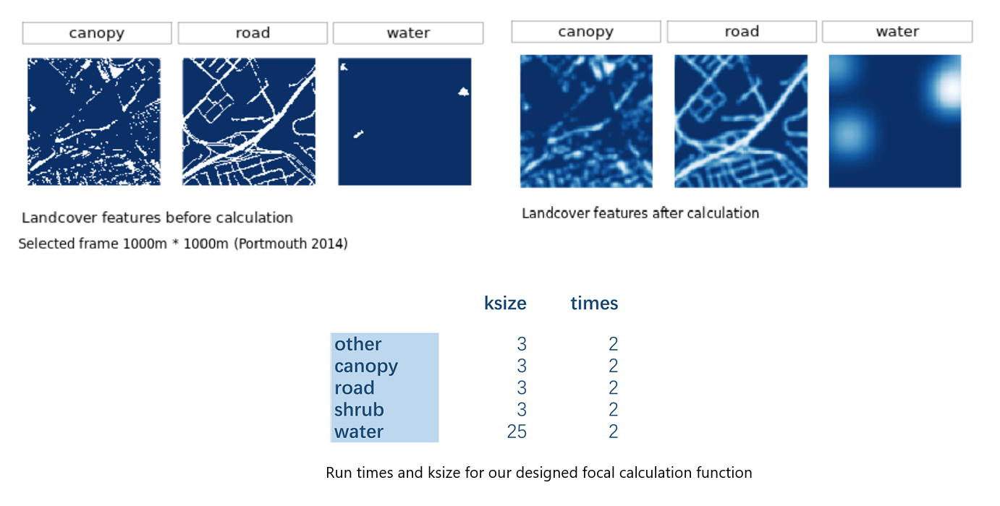
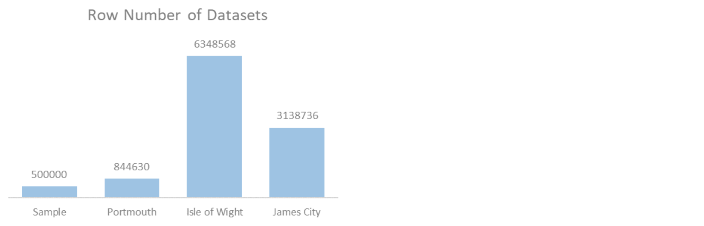

```{r setup, include=FALSE}
knitr::opts_chunk$set(echo = TRUE)
```

[Return to MUSA 801 Projects Page](https://pennmusa.github.io/MUSA_801.io/)

This project was completed for the MUSA/Smart Cities Practicum course (MUSA 801) instructed by Michael Fichman and Matthew Harris. We are grateful to our instructors for their continued support and feedback. We would like to give special thanks to KC Filippino and Ben McFarlane from Hampton Roads Planning District Commission, and Dexter Locke from the United States Forest Service for providing data, insight, and support throughout the semester. This project would not have been possible without them.

[View Dashboard](https://yuewendai.github.io/MUSA-Practicum-Web/)

## 1.Introduction
### 1.1 Abstract
This project aims to develop a precision forecast model for land cover change at the Chesapeake Watershed. By leveraging high-resolution longitudinal land cover data provided by the Chesapeake Conservancy, the model will predict land cover conversions from pervious to impervious surfaces. This forecast will enable land use and environmental planners to identify where urban growth will occur, propose green infrastructure accordingly, and prioritize lands for protection. The model will be generalizable to the county level, incorporating only widely available inputs, thus allowing any municipality within the Chesapeake basin to replicate the analysis. This proof-of-concept project will demonstrate the utility of precision conservation in land protection and green infrastructure planning and provide a valuable tool for planners and policymakers across the region.

### 1.2 Background 
The Chesapeake Bay watershed is an ecologically and economically significant resource, encompassing diverse ecosystems and supporting a multitude of industries, including agriculture, tourism, and fisheries. However, the region is facing increasing environmental challenges due to the combined effects of sea-level rise and land subsidence. As a result, the area has become the second-most vulnerable region in the nation to flooding and storm surge, only after New Orleans. Predicting land cover changes, particularly the conversion from pervious to impervious surfaces, is crucial in addressing these challenges and informing climate adaptation and mitigation planning.

Our project focuses on three distinct counties within the Chesapeake Bay watershed, representing varying development contexts. Portsmouth is the urban prototype characterized by its dense residential, commercial, and industrial areas. James City County exemplifies a suburban context, with a mix of rural, suburban, and urban development and a diverse landscape encompassing forests, wetlands, and historic sites. Lastly, Isle of Wight County represents the rural aspect, predominantly characterized by agriculture, forestry, and extensive natural habitats. By considering these diverse counties, we can develop a comprehensive and generalizable model to predict land cover changes across various regional development scenarios.


### 1.3 Motivation & Use Case

Building resilient communities is a top priority for the Hampton Roads Planning District Commission (HRPDC). To support this goal, the HRPDC has established a green infrastructure plan that seeks to identify and prioritize a network of valuable conservation lands. This plan aims to achieve multiple benefits, such as habitat protection, drinking water supply protection, stormwater management, and recreational opportunities.

A crucial component of this plan involves developing a model to forecast potential future growth and identify areas of the green infrastructure network that are most at risk for development. Our project aims to create a forecast that enables land use and environmental planners to pinpoint where urban growth is likely to occur, propose green infrastructure accordingly, and prioritize lands for protection. 

This proof-of-concept project demonstrates the utility of precision conservation in land protection and green infrastructure planning, providing a valuable tool for planners and policymakers across the region. For example, Andrew, the head of the Green Infrastructure Team from Chesapeake Conservancy, and his team will use our web app to make informed decisions on which regions have the highest priority to receive funding.




## 2. Data and Methods

### 2.1 Understanding Land Cover data
The Chesapeake Conservancy provided high-resolution land cover data for 2013/14 and 2017/18. This vast raster dataset boasts an impressive 1-meter accuracy, offering 900 times more detail than the commonly used 30-meter resolution National Land Cover Dataset. Such a level of detail is crucial for capturing subtle changes in land cover.

The land cover classification includes pervious surfaces such as tree canopies and shrubs, which allow water to infiltrate the ground. In contrast, impervious surfaces encompass categories like roads and structures that prevent water infiltration, leading to increased runoff and potential flooding issues. Even though water and wetland are often considered impervious surfaces, in this study, we classify them as pervious surfaces due to their dynamic nature, interaction with groundwater, floodplain connectivity, and the critical functions of wetlands in water storage and infiltration. 


[Data Source](https://www.chesapeakeconservancy.org/conservation-innovation-center/high-resolution-data/lulc-data-project-2022/)


### 2.2 Ohter data
To understand how landcover change is affected by other environmental, social and economical factors, we also acquire data from the following source: 

* [DEM ( 1 arc-second) from USGS](https://apps.nationalmap.gov/downloader/)

* [Soil Data from the Web Soil Survey](https://websoilsurvey.nrcs.usda.gov/app/)

* census tract-level data (2014, 2018, 2021) from four years of the American Community Survey (ACS) 

### 2.3 Unit of analysis
To make it easier for our future analysis, we gathered and resampled all data to 10 x 10 meters resolution as the basic analysis unit to ensure consistency.


## 3. Exploratory Analysis

### 3.1 Land Cover Type and Change Dynamics
We began by comparing the land cover patterns and changes across the three counties. This comparison helped us identify each county's unique characteristics and trends, providing insights into how urban, suburban, and rural contexts affected land cover conversion. Land cover changes are highly related to the existing land cover type. For James City and Isle of Wight, tree canopy is the land cover type that undergoes the most change, while for Portsmouth, low vegetation experiences the most significant change.



### 3.2 Environmental Factors

Environmental factors played a significant role in land cover changes. We examined site characteristics that remained constant over time, such as elevation, slope, and soil type, to understand their influence on land cover conversion patterns. Understanding these static factors helped us predict how land cover might evolve in different environmental settings.

Take Portsmouth county as example, the plot below demonstrates that the mean slope in areas where land cover changed from pervious to impervious between 2014 and 2018 (1) is significantly higher than in areas that did not change or changed in the opposite direction (0).


### 3.3 Social and Economical Factors
Social and economic factors, which change over time, also impact land cover changes. We investigated variables such as population growth, economic development, and demographic changes to understand how these factors contributed to land cover conversion. By incorporating these dynamic factors into our analysis, we were able to better forecast land cover changes based on potential future scenarios.

The plots presented here illustrate that the percentage of white population change exhibits a different pattern in areas of land cover change compared to the overall county. This observation indicates that in Portsmouth County, land cover change is also associated with changes in census data, particularly the percentage of white population change.


## 4. Feature Engineering

### 4.1 Spatial Effects
Incorporating spatial relationships into our model was crucial for capturing the spatial influence of original land cover types on land cover change. We performed focal raster calculations and spatial lag calculations to create features that accounted for the spatial context of land cover conversion. These engineered features helped us develop a more accurate and robust predictive model, capable of capturing the nuances of land cover change across diverse development contexts.



### 4.2 Final Features (Need Check!)
#### Dependent Variable
* Whether the land cover change from impervious to previous 

#### Independent Variables

* Existing land cover types 
    + Pop change
    + Pct of white change 
    + Unitchange
    + Median Household Income change   

* Environmental factors
    + Elevation (Terrain)
    + Slope
    + Soil Type

* Socio-economic factors 
    + Pop change
    + Pct of white change 
    + Unitchange
    + Median Household Income change    

* Spatial Lag factors 
    + Pop change
    + Pct of white change 
    + Unitchange
    + Median Household Income change 


## 5. Modeling & Evaluation (Need Check!)

### 5.1 Model Building
To ensure computational efficiency and scalability, we downsampled the original dataset to 500,000 data points for model building and then fitted the selected model back to the whole dataset for future predictions. We employed geo cross-validation at the block group level to ensure the robustness of our model and avoid overfitting.

Performance evaluation was conducted using the confusion matrix for binary threshold setting and model selection. This approach allowed us to assess the accuracy, sensitivity, and specificity of the models and compare their performance.



### 5.2 Model Type Selection

Recognizing that different types of models perform well on different datasets, we experimented with three model types for predicting land cover change: Random Forest, XGBoost, and Binomial Generalized Linear Model (GLM). These models were chosen due to their ability to handle complex interactions and non-linear relationships within the data.

After evaluating the performance of each model type, we selected Random Forest as the most suitable model for our analysis, as it demonstrated the best accuracy. Random Forest is an ensemble learning method that builds multiple decision trees and combines their results to improve overall accuracy and stability. This model is particularly well-suited for handling high-dimensional and noisy data, making it an ideal choice for predicting land cover changes in our study area.


### 5.3 Refine for better prediction


### 5.4 Model Evaluation & Validation

roc


### 5.5 Comparison between Counties


## 6. Prediction & Error Analysis

By comparing the predicted 2018 land cover change with the observed change, we can tell that errors in the prediction are likely to be around the true value, indicating the effectiveness of the model. Looking at the future prediction of 2021, we can see that many of the predicted changes are consistent with the observed change. However, the model has also identified new areas of land cover change. This suggests that the model is able to detect changes that were not previously observed, which can be valuable for land management and conservation efforts.


## 6. Conclusion

## 7. Code Appendix
