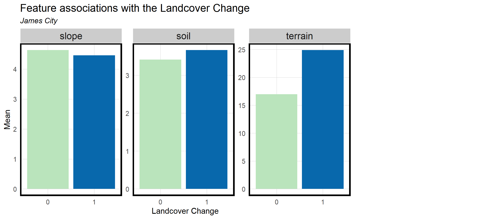
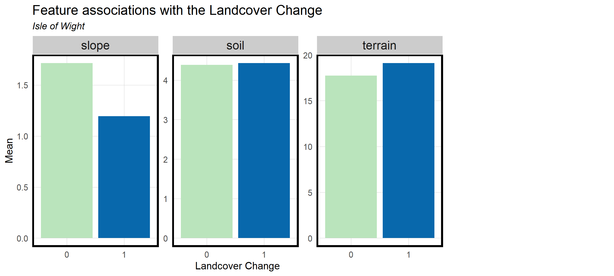
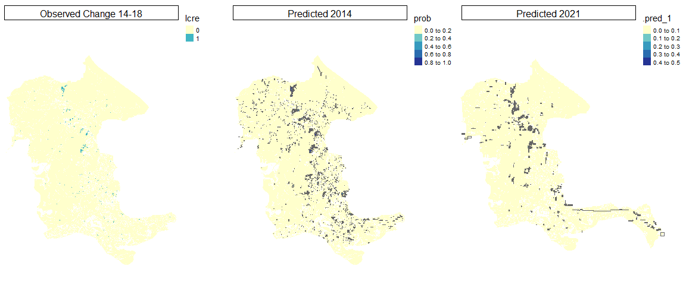

```{r setup, include=FALSE}
knitr::opts_chunk$set(echo = TRUE)
```

[Return to MUSA 801 Projects Page](https://pennmusa.github.io/MUSA_801.io/)

This project was completed for the MUSA/Smart Cities Practicum course (MUSA 801) instructed by Michael Fichman and Matthew Harris. We are grateful to our instructors for their continued support and feedback. We would like to give special thanks to KC Filippino and Ben McFarlane from Hampton Roads Planning District Commission, and Dexter Locke from the United States Forest Service for providing data, insight, and support throughout the semester. This project would not have been possible without them.

[View Dashboard](https://yuewendai.github.io/MUSA-Practicum-Web/)

## 1.Introduction

### 1.1 Abstract

This project aims to develop a precision forecast model for land cover change at the Chesapeake Watershed. By leveraging high-resolution longitudinal land cover data provided by the Chesapeake Conservancy, the model will predict land cover conversions from pervious to impervious surfaces. This forecast will enable land use and environmental planners to identify where urban growth will occur, propose green infrastructure accordingly, and prioritize lands for protection. The model will be generalizable to the county level, incorporating only widely available inputs, thus allowing any municipality within the Chesapeake basin to replicate the analysis. This proof-of-concept project will demonstrate the utility of precision conservation in land protection and green infrastructure planning and provide a valuable tool for planners and policymakers across the region.

### 1.2 Background

The Chesapeake Bay watershed is an ecologically and economically significant resource, encompassing diverse ecosystems and supporting a multitude of industries, including agriculture, tourism, and fisheries. However, the region is facing increasing environmental challenges due to the combined effects of sea-level rise and land subsidence. As a result, the area has become the second-most vulnerable region in the nation to flooding and storm surge, only after New Orleans. Predicting land cover changes, particularly the conversion from pervious to impervious surfaces, is crucial in addressing these challenges and informing climate adaptation and mitigation planning.

Our project focuses on three distinct counties within the Chesapeake Bay watershed, representing varying development contexts. Portsmouth is the urban prototype characterized by its dense residential, commercial, and industrial areas. James City County exemplifies a suburban context, with a mix of rural, suburban, and urban development and a diverse landscape encompassing forests, wetlands, and historic sites. Lastly, Isle of Wight County represents the rural aspect, predominantly characterized by agriculture, forestry, and extensive natural habitats. By considering these diverse counties, we can develop a comprehensive and generalizable model to predict land cover changes across various regional development scenarios.


### 1.3 Motivation & Use Case

Building resilient communities is a top priority for the Hampton Roads Planning District Commission (HRPDC). To support this goal, the HRPDC has established a green infrastructure plan that seeks to identify and prioritize a network of valuable conservation lands. This plan aims to achieve multiple benefits, such as habitat protection, drinking water supply protection, stormwater management, and recreational opportunities.

A crucial component of this plan involves developing a model to forecast potential future growth and identify areas of the green infrastructure network that are most at risk for development. Our project aims to create a forecast that enables land use and environmental planners to pinpoint where urban growth is likely to occur, propose green infrastructure accordingly, and prioritize lands for protection.

This proof-of-concept project demonstrates the utility of precision conservation in land protection and green infrastructure planning, providing a valuable tool for planners and policymakers across the region. For example, Andrew, the head of the Green Infrastructure Team from Chesapeake Conservancy, and his team will use our web app to make informed decisions on which regions have the highest priority to receive funding.


## 2. Data and Methods

### 2.1 Understanding Land Cover data

The Chesapeake Conservancy provided high-resolution land cover data for 2013/14 and 2017/18. This vast raster dataset boasts an impressive 1-meter accuracy, offering 900 times more detail than the commonly used 30-meter resolution National Land Cover Dataset. Such a level of detail is crucial for capturing subtle changes in land cover.

The land cover classification includes pervious surfaces such as tree canopies and shrubs, which allow water to infiltrate the ground. In contrast, impervious surfaces encompass categories like roads and structures that prevent water infiltration, leading to increased runoff and potential flooding issues. Even though water and wetland are often considered impervious surfaces, in this study, we classify them as pervious surfaces due to their dynamic nature, interaction with groundwater, floodplain connectivity, and the critical functions of wetlands in water storage and infiltration.


[Data Source](https://www.chesapeakeconservancy.org/conservation-innovation-center/high-resolution-data/lulc-data-project-2022/)

### 2.2 Ohter data

To understand how landcover change is affected by other environmental, social and economical factors, we also acquire data from the following source:

-   [DEM ( 1 arc-second) from USGS](https://apps.nationalmap.gov/downloader/)

-   [Soil Data from the Web Soil Survey](https://websoilsurvey.nrcs.usda.gov/app/)

-   census tract-level data (2014, 2018, 2021) from four years of the American Community Survey (ACS)

### 2.3 Unit of analysis

To facilitate our future analysis and ensure consistency, we gathered and resampled all data to a 10 x 10-meter resolution as the basic analysis unit. We opted for a 10-meter resolution as it provides sufficient detail for planning purposes while minimizing noise and reducing the dataset size, thereby enabling a faster calculation process.


## 3. Exploratory Analysis

### 3.1 Land Cover Type and Change Dynamics

Land cover changes are highly related to the existing land cover type. We began by comparing the land cover patterns and changes across the three counties. This comparison helped us identify each county's unique characteristics and trends, providing insights into how urban, suburban, and rural contexts affected land cover conversion. For James City and Isle of Wight, tree canopy is the land cover type that undergoes the most change, while for Portsmouth, low vegetation experiences the most significant change.


Then we look into each different land cover type. Pervious surface including canopy, shrubs, low vegetation, wetlands, and water.

####  {.tabset}

##### Portsmouth


##### James City


##### Isle of Wight


####  {.unnumbered}

Impervious surface including barren, road, structure and others.

####  {.tabset}

##### Portsmouth


##### James City


##### Isle of Wight


####  {.unnumbered}

After reclassifying land cover to 0 (pervious surface) and 1 (impervious surface), we use the 2018 value minus the 2014 value and get 1 as those change from pervious to impervious surface, 0 as those didn't change, and -1 as those change from impervious to pervious surface. Then we reclassify 1 stay as the land cover change from pervious to impervious from 2014 to 2018, 0 and -1 all as 0 for other situations.


### 3.2 Environmental Factors

Environmental factors played a significant role in land cover changes. To understand their influence on land cover conversion patterns, we examined site characteristics that remained constant over time, such as elevation (terrain), slope, and soil type. Understanding these static factors helped us predict how land cover might evolve in different environmental settings.

####  {.tabset}

##### Portsmouth


##### James City


##### Isle of Wight


####  {.unnumbered}

The plots below demonstrate that in Portsmouth, the mean slope in areas where land cover changed from pervious to impervious between 2014 and 2018 (1) is significantly higher than in areas that did not change or change in the opposite direction (0). This is the opposite of the pattern shown at the Isle of Wight, possibly due to the very different nature of urban and rural development. Soil and terrain show little difference across the two categories for both two counties. But at James City, the mean elevation in areas where land cover changed from pervious to impervious between 2014 and 2018 (1) is significantly higher than in areas that did not change or change in the opposite direction (0).

####  {.tabset}

##### Portsmouth


##### James City



##### Isle of Wight



####  {.unnumbered}

### 3.3 Social and Economical Factors

Social and economic factors, which change over time, also impact land cover changes. We investigated variables such as population growth, economic development, and demographic changes to understand how these factors contributed to land cover conversion. By incorporating these dynamic factors into our analysis, we were able to better forecast land cover changes based on potential future scenarios.

The factors are calculated with the formula below:

      Pop change = (TotalPop2018 - TotalPop2014) / (TotalPop2018 * area),
      Pct of white change = (pctWhite2018 - pctWhite2014),
      Unitchange = (TotalUnit2018 - TotalUnit2014) / area,
      MedHHIncchange = (MedHHInc2018 - MedHHInc2014) / area

####  {.tabset}

##### Portsmouth


##### James City


##### Isle of Wight


####  {.unnumbered}

The plots presented here illustrate that in Portsmouth, the Median household income, percentage of white population change, and unit change exhibit a different pattern in areas where land cover changed from pervious to impervious between 2014 and 2018 (1) compared to the other situations (0). In James City, all five factors show different patterns across the two categories, but the percentage of white population change varies the most. In the Isle of Wight, the percentage of white population change, total population change, and unit change exhibits a different pattern in areas where land cover changed from pervious to impervious between 2014 and 2018 (1) compared to the other situations (0).

####  {.tabset}

##### Portsmouth


##### James City


##### Isle of Wight


####  {.unnumbered}

## 4. Feature Engineering

### 4.1 Spatial Effects

Incorporating spatial relationships into our model was crucial for capturing the spatial influence of original land cover types on land cover change. We performed focal raster calculations and spatial lag calculations to create features that accounted for the spatial context of land cover conversion. These engineered features helped us develop a more accurate and robust predictive model, capable of capturing the nuances of land cover change across diverse development contexts.


### 4.2 Pairwise Correlations

To select variables for our predictive model, we visualize correlations between our numeric risk factors. This helps us ensure that our variables are not correlated with one another.


### 4.3 Final Features

Based on this plot, we select the following variables to use in our model:

#### Dependent Variable

-   Whether the land cover change from impervious to previous

#### Independent Variables

-   Existing land cover types
    -   shrub
    -   water
    -   canopy
    -   road
    -   other (other impervious surface besides road)
    -   impervious density
-   Environmental factors
    -   terrain (Elevation)
    -   slope
    -   soil type
-   Socio-economic factors
    -   population change
    -   percent of white change
    -   unit change
    -   median household income change
    -   area of census block group
-   Spatial Lag factors
    -   nonlinear transformation to predictor x
    -   nonlinear transformation to predictor y

## 5. Modeling & Evaluation

### 5.1 Model Building

To ensure computational efficiency and scalability, we downsampled the original dataset to 500,000 data points for model building and then fitted the selected model back to the whole dataset for future predictions. We employed geo cross-validation at the block group level to ensure the robustness of our model and avoid overfitting.

Performance evaluation was conducted using the confusion matrix for binary threshold setting and model selection. This approach allowed us to assess the accuracy, sensitivity, and specificity of the models and compare their performance.

The Whole modeling process is shown as below. We basically follow the steps: 

- Choose the model type across three counties 
- Refine and build model for each county. 

We also utilize the computing power of virtual machines to help us run several Rscripts simultaneously.

[Link to setting up rstudio on google cloud vm](https://github.com/YuewenDai/MUSA-Practicum-Web/blob/main/README.md)


### 5.2 Model Type Selection

Recognizing that different types of models perform well on different datasets, we experimented with three model types for predicting land cover change: Random Forest, XGBoost, and Binomial Generalized Linear Model (GLM). These models were chosen due to their ability to handle complex interactions and non-linear relationships within the data.

After evaluating the performance of each model type, we selected Random Forest as the most suitable model for our analysis, as it demonstrated the best accuracy. Random Forest is an ensemble learning method that builds multiple decision trees and combines their results to improve overall accuracy and stability. This model is particularly well-suited for handling high-dimensional and noisy data, making it an ideal choice for predicting land cover changes in our study area.

####  {.tabset}

##### Model results for three counties

In the first step of our model type selection. We noticed there was a risk of overfitting and leaking features that make our models have terrible ability to detect the change even though they appeared to have good accuracy!


####  {.unnumbered}


### 5.3 Refine for better prediction

To solve the problem that we have an extremely unbalanced data set, we first filter data set to only use original pervious land cover data. And to help our models learn more about the characteristic of land cover changing from pervious to impervious we balance the data set to (y=1:y=0)= 1:10.We also trained our model for multiple times to make a more stable prediction for the result.

####  {.tabset}

##### Balance the Dataset

We compared our results after sampling for a balanced data set, we test the ratio of y=1/y=0 = 1:3 or 1:10, by comparing the results between two smaller counties. We use 1:10 for our models.


####  {.tabset}

##### Resample and Retrain


To minimize the impact of random results generated during the downsampling process, we implemented a more robust approach by resampling and training the model 2-3 times for each county. We then selected the best-performing model based on the Kappa statistic and the p-value for the [Acc > NIR] comparison. This method ensures a more reliable model selection that better represents the underlying patterns and relationships between land cover changes and various factors across the different counties.


####  {.unnumbered}

### 5.4 Model Evaluation & Validation

For our use case, we set the threshold at the point where sensitivity equals specificity to allow for a balance between correctly identifying positive cases (sensitivity) and correctly identifying negative cases (specificity)

####  {.tabset}

##### Portsmouth


##### James City


##### Isle of Wight


####  {.unnumbered}

We assessed the model's generalizability by calculating the Mean Absolute Percentage Error (MAPE) for each census block group. The results show that in Portsmouth, our model has a low MAPE for the majority of neighborhoods, with slightly higher MAPE values observed in some block groups located in the southern region. In James City, the MAPE is relatively consistent across the block groups, with only one exhibiting a higher MAPE that could be considered an outlier. These findings suggest that our models are indeed generalizable and can effectively capture the patterns of land cover changes across different block groups within the counties.

####  {.tabset}

##### Portsmouth


##### James City


####  {.unnumbered}

### 5.5 Comparison between Counties

The plots below indicate that spatial lag factors play a crucial role in land cover change prediction for all three counties. In addition, terrain, water, soil, and canopy emerge as important features across James City, Isle of Wight, and Portsmouth counties. For James City and Isle of Wight, slope is also a significant feature, whereas its importance is reduced in Portsmouth. This difference can be attributed to the urban nature of Portsmouth, where landforms less influence urban growth.

In Portsmouth, social and economic factors such as the percentage of white population change and median household income demonstrate greater significance in predicting land cover change. This suggests that urban growth in Portsmouth is more closely tied to socioeconomic factors, reflecting the distinctive characteristics of each county and the need for tailored land cover change modeling approaches.


## 6. Prediction & Error Analysis

In this section, we present the visualizations of our model's results, highlighting areas where land cover changes from pervious to impervious surfaces are most likely to occur.

In James City County, the model predicts land cover changes are more likely to happen in areas with steeper slopes and in close proximity to existing development, particularly in the northern and southeastern parts of the county.

In Portsmouth County, the conversion from pervious to impervious surfaces is predicted to be more likely in two waterfront areas located in the eastern part of the county and in the midtown region.

In Isle of Wight County, land cover changes from pervious to impervious surfaces appear to be more scattered throughout the region, reflecting a more diverse pattern of potential development.


By comparing the predicted and observed result, model captured some clustering characteristics of land cover change.

####  {.tabset}

##### Portsmouth


##### James City



##### Isle of Wight


####  {.unnumbered}

To better understand the precision forecast , we select a sample square with a size of 1000m \* 1000m in Portsmouth. By comparing the result in such a detailed scale, we can tell that errors in the prediction are likely to be around the true value, indicating the effectiveness of the model.

Looking at the future prediction of 2021, we can see that many of the predicted changes are consistent with the observed change. Moreover, the model has identified new areas of land cover change. This suggests that the model is able to detect changes that were not previously observed, which can be valuable for land management and conservation efforts.


## 7. App Development

[Link to our app](https://yuewendai.github.io/MUSA-Practicum-Web/)

Once we have obtained the prediction results from our machine learning model, we input them into a web application. At the core of this application is an interactive map that allows users to view the probability of each county's region transitioning from permeable to impermeable in the future by selecting various layers. The probability interval is divided into five equal parts based on its highest value, with the high probability change areas highlighted in red. Users can further click on the "check layer" to view specific information about these high probability conversion areas, including their past land cover types and the specific numerical values of their probability of conversion. The high-risk areas are marked in red, making them easier to locate quickly. Users can also select other relevant information from a dropdown list, such as complete land cover maps from 2014/2018 and census tract data. This information can assist decision-makers in balancing their decisions on whether to protect certain areas.


## 8. Conclusion

In conclusion, we successfully designed and set up an efficient workflow for testing and modeling land cover change predictions. Our chosen model, Random Forest, achieved a high balanced accuracy of approximately 98%, with performance metrics indicating that it generalizes well across different counties and land cover types. However, the model scripts require a considerable amount of time to run, which might pose challenges for replication and scalability.

Additionally, the model demonstrates lower accuracy in predicting land cover change compared to no change, which can be attributed to the uneven distribution of data. Despite these limitations, we are confident that our model and accompanying app can significantly contribute to the utility of precision conservation in land protection and green infrastructure planning. Ultimately, our project provides a valuable tool for planners and policymakers across the region, enabling them to make informed decisions on land use management and conservation strategies.

## 9. Code Appendix

```{r eval=FALSE}

########### Required Packages ###########
packages = c("stars","starsExtra", "abind","tigris","tidycensus","dplyr",
             "bayesplot", "lme4","RcppEigen","knitr","yardstick",
             "tidyverse", "tidyr", "broom", "caret", "dials", "doParallel", "e1071", "earth",
             "ggrepel", "glmnet", "ipred", "klaR", "kknn", "pROC", "rpart", "randomForest",
             "sessioninfo", "tidymodels","ranger", "recipes", "workflows", "themis","xgboost",
             "sf", "nngeo", "mapview","raster")


########### Define Functions ###########

Load.fun <- function(x) { 
  x <- as.character(x) 
  if(isTRUE(x %in% .packages(all.available=TRUE))) { 
    eval(parse(text=paste("require(", x, ")", sep=""))) 
    print(paste(c(x, " : already installed; requiring"), collapse=''))
  } else { 
    #update.packages()
    print(paste(c(x, " : not installed; installing"), collapse=''))
    eval(parse(text=paste("install.packages('", x, "')", sep=""))) 
    print(paste(c(x, " : installed and requiring"), collapse=''))
    eval(parse(text=paste("require(", x, ")", sep=""))) 
  } 
} 

for(i in seq_along(packages)){
  packge <- as.character(packages[i])
  Load.fun(packge)
}

plotTheme <- function(base_size = 12, title_size = 12) {
  theme(
   text = element_text( color = "black"),
   plot.title = element_text(size = title_size, colour = "black"), 
        plot.subtitle = element_text(face="italic"),
       plot.caption = element_text(hjust=0),
         axis.ticks = element_blank(),
         panel.background = element_blank(),
         panel.grid.minor = element_line("grey90", size = 0.01),
         panel.grid.major = element_line("grey90", size = 0.01),
         panel.border = element_rect(colour = "white" , fill=NA, size=0),
         strip.background = element_rect(color = "white",fill='white'),
         strip.text = element_text(size=12),
         axis.title = element_text(size=12),
         axis.text = element_text(size=10),
         plot.background = element_blank(),
         legend.background = element_blank(),
         legend.title = element_text(colour = "black", face = "italic"),
         legend.text = element_text(colour = "black", face = "italic"),
         strip.text.x = element_text(size = 8)
       )
   }
mapTheme <- theme(plot.title =element_text(size=12),
                  plot.subtitle = element_text(size=8),
                  plot.caption = element_text(size = 6),
                  axis.line=element_blank(),
                  axis.text.x=element_blank(),
                  axis.text.y=element_blank(),
                  axis.ticks=element_blank(),
                  axis.title.x=element_blank(),
                  axis.title.y=element_blank(),
                  panel.background=element_blank(),
                  panel.border=element_blank(),
                  panel.grid.major=element_line(colour = 'transparent'),
                  panel.grid.minor=element_blank(),
                  legend.direction = "vertical", 
                  legend.position = "right",
                  legend.key.height = unit(1, "cm"), legend.key.width = unit(0.2, "cm"))

palette2 <- c("#41b6c4","#253494")
palette4 <- c("#a1dab4","#41b6c4","#2c7fb8","#253494")
palette5 <- c("#ffffcc","#a1dab4","#41b6c4","#2c7fb8","#253494")
palette10 <- c("#f7fcf0","#e0f3db","#ccebc5","#a8ddb5","#7bccc4",
                        "#4eb3d3","#2b8cbe","#0868ac","#084081","#f7fcf0")

#########################################################################################################################################
###################################################  --------------------  ##############################################################
################################################### |                    | ##############################################################
################################################### |  DATA PREPARATION  | ##############################################################
################################################### |                    | ##############################################################
###################################################  --------------------  ##############################################################
#########################################################################################################################################

# load all the land cover data
port_14 <- read_stars("~/Github/Precision-Forecasts-of-Land-Cover-Change/Data/lc/port_51740_lc_2014/port_51740_landcover_2014.tif") 
port_18 <- read_stars("~/Github/Precision-Forecasts-of-Land-Cover-Change/Data/lc/port_51740_lc_2018/port_51740_landcover_2018.tif")
jame_14 <- read_stars("~/Github/Precision-Forecasts-of-Land-Cover-Change/Data/lc/jame_51095_lc_2014/jame_51095_landcover_2014.tif")
jame_18 <- read_stars("~/Github/Precision-Forecasts-of-Land-Cover-Change/Data/lc/jame_51095_lc_2018/jame_51095_landcover_2018.tif")

isle_14_10 <- read_stars("~/Github/Precision-Forecasts-of-Land-Cover-Change/Data/lc/isle_14_10.tif")
isle_18_10 <- read_stars("~/Github/Precision-Forecasts-of-Land-Cover-Change/Data/lc/islelc_18_10x10.tif")

# load all the boundary data 
port_area <- st_read("~/Github/Precision-Forecasts-of-Land-Cover-Change/Data/boundary/portsmouth.shp")
jame_area <- st_read("~/Github/Precision-Forecasts-of-Land-Cover-Change/Data/boundary/James.shp")
isle_area <- st_read("~/Github/Precision-Forecasts-of-Land-Cover-Change/Data/boundary/Isle_of_Wight.shp")

#############################################################################################################################
#############################################  --------------------  ########################################################
############################################# | LANDCOVER DATASET  | ########################################################
#############################################  --------------------  ########################################################
#############################################################################################################################


# Resample the raster image to 10x10 cells
port_14_10 <- st_warp(port_14, cellsize = 10, crs = st_crs(port_14))
port_18_10 <- st_warp(port_18, cellsize = 10, crs = st_crs(port_18))
jame_14_10 <- st_warp(jame_14, cellsize = 10, crs = st_crs(jame_14))
jame_18_10 <- st_warp(jame_18, cellsize = 10, crs = st_crs(jame_18))

port_area <- port_area %>% 
  st_transform(crs = st_crs(port_18))
jame_area <- jame_area %>% 
  st_transform(crs = st_crs(jame_18))
isle_area <- isle_area %>% 
  st_transform(crs = st_crs(isle_18_10))

# Crop the resampled raster image to the test area
port_14_10_crop <- st_crop(port_14_10, port_area)
port_18_10_crop <- st_crop(port_18_10, port_area)
jame_14_10_crop <- st_crop(jame_14_10, jame_area)
jame_18_10_crop <- st_crop(jame_18_10, jame_area)
isle_14_10_crop <- st_crop(isle_14_10, isle_area)
isle_18_10_crop <- st_crop(isle_18_10, isle_area)


# Create land cover change feature
port_change <- c(port_18_10_crop - port_14_10_crop)%>%
  mutate(lcchange = case_when(port_51740_landcover_2018.tif != 0 ~ 1,
                              port_51740_landcover_2018.tif != 0 ~ 0))
jame_change <- c(jame_18_10_crop - jame_14_10_crop)%>%
  mutate(lcchange = case_when(jame_51095_landcover_2018.tif != 0 ~ 1,
                              jame_51095_landcover_2014.tif!= 0 ~ 0))
isle_change <- c(isle_18_10_crop - isle_14_10_crop)%>%
  mutate(lcchange = case_when(islelc_18_10x10.tif != 0 ~ 1,
                              islelc_18_10x10.tif != 0 ~ 0))

# Reclassify the cropped raster image
port_14_10_rc <- port_14_10_crop %>% 
  mutate(
    originallc =  port_51740_landcover_2014.tif,
    lc = case_when(
    port_51740_landcover_2014.tif < 6  ~ 0, # previous
    port_51740_landcover_2014.tif >= 6 ~ 1 # impervious
  ))
port_18_10_rc <- port_18_10_crop %>% 
  mutate(
    originallc =  port_51740_landcover_2018.tif,
    lc = case_when(
    port_51740_landcover_2018.tif < 6  ~ 0,
    port_51740_landcover_2018.tif >= 6 ~ 1
  ))
jame_14_10_rc <- jame_14_10_crop %>% 
  mutate(originallc = jame_51095_landcover_2014.tif,
         lc = case_when(
         jame_51095_landcover_2014.tif < 6  ~ 0, # permeable
         jame_51095_landcover_2014.tif >= 6 ~ 1 # impermeable
         ))
jame_18_10_rc <- jame_18_10_crop %>% 
  mutate(originallc = jame_51095_landcover_2018.tif,
         lc = case_when(
           jame_51095_landcover_2018.tif < 6  ~ 0,
           jame_51095_landcover_2018.tif >= 6 ~ 1
         ))

isle_14_10_rc <- isle_14_10_crop %>% 
  mutate(originallc = case_when(
    islelc_14_10x10.tif == 1  ~ 1,
    islelc_14_10x10.tif == 2 ~ 2,
    islelc_14_10x10.tif == 3 ~ 3,
    islelc_14_10x10.tif == 4 ~ 4,
    islelc_14_10x10.tif == 5 ~ 5,
    islelc_14_10x10.tif == 6 ~ 6,
    islelc_14_10x10.tif == 7 ~ 7,
    islelc_14_10x10.tif == 8 ~ 8,
    islelc_14_10x10.tif == 9 ~ 9,
    islelc_14_10x10.tif == 10 ~ 10,
    islelc_14_10x10.tif == 11  ~ 11,
    islelc_14_10x10.tif == 12 ~ 12
  ),
  lc = case_when(
    islelc_14_10x10.tif < 6  ~ 0, # permeable
    islelc_14_10x10.tif >= 6 ~ 1 # impermeable
  ))
isle_18_10_rc <- isle_18_10_crop %>% 
  mutate(
    originallc =case_when(
      islelc_18_10x10.tif == 1  ~ 1,
      islelc_18_10x10.tif == 2 ~ 2,
      islelc_18_10x10.tif == 3 ~ 3,
      islelc_18_10x10.tif == 4 ~ 4,
      islelc_18_10x10.tif == 5 ~ 5,
      islelc_18_10x10.tif == 6 ~ 6,
      islelc_18_10x10.tif == 7 ~ 7,
      islelc_18_10x10.tif == 8 ~ 8,
      islelc_18_10x10.tif == 9 ~ 9,
      islelc_18_10x10.tif == 10 ~ 10,
      islelc_18_10x10.tif == 11  ~ 11,
      islelc_18_10x10.tif == 12 ~ 12
    ),
    lc = case_when(
      islelc_18_10x10.tif < 6  ~ 0,
      islelc_18_10x10.tif >= 6 ~ 1
    ))
# Create reclassed land cover change feature
port_change_rc <- (port_18_10_rc - port_14_10_rc)
jame_change_rc <- (jame_18_10_rc - jame_14_10_rc)
isle_change_rc <- (isle_18_10_rc - isle_14_10_rc)

#remove
rm(port_14_10,port_18_10,port_14,port_18)
rm(jame_14_10,jame_18_10,jame_14,jame_18)
rm(isle_14_10,isle_18_10,isle_14,isle_18)


#############################################################################################################################
#############################################  --------------------  ########################################################
############################################# |  CENSCUS DATASET   | ########################################################
#############################################  --------------------  ########################################################
#############################################################################################################################


## load census

options(tigris_use_cache = TRUE)

census_api_key("bd4ce20561125a8480632db6acb29869e040ed08",install = TRUE)

# Define function to retrieve census data for a given county and year
get_county_data <- function(state, county, year) {
  get_acs(
    geography = "block group",
    variables = c("B01003_001E","B02001_002E","B19013_001E","B25002_001E","B06012_002E","B27011_008E"),
    year = year,
    state = state,
    county = county,
    geometry = TRUE,
    output = "wide"
  ) %>%
    st_transform(st_crs(port_14)) %>%
    rename(
      TotalPop = B01003_001E,
      Whites = B02001_002E,
      MedHHInc = B19013_001E,
      TotalUnit = B25002_001E
    ) %>%
    mutate(
      pctWhite = ifelse(TotalPop > 0, Whites / TotalPop * 100, 0),
      area = st_area(geometry)
    ) %>%
    dplyr::select(-NAME, -starts_with("B"),-Whites)%>%
    fill(everything())
}

# Define function to calculate changes in census variables between two years
calculate_changes <- function(data1, data2) {
  data2 %>%
    st_join(data1,left = TRUE) %>%
    mutate(
      popchange = (TotalPop.y - TotalPop.x) / (TotalPop.x * area.x),
      pctwhitechange = (pctWhite.y - pctWhite.x),
      Unitchange = (TotalUnit.y - TotalUnit.x) / area.x,
      MedHHIncchange = (MedHHInc.y - MedHHInc.x) / area.x,
      Area = area.x,
      GEOID = GEOID.x
    )%>%
    dplyr::select(-ends_with(".x"),-ends_with(".y"))
}

# Retrieve census data for Portsmouth in 2014 and 
portsmouth_14 <- get_county_data(state = "51", county = "Portsmouth", year = 2014)
portsmouth_18 <- get_county_data(state = "51", county = "Portsmouth", year = 2018)
portsmouth_21 <- get_county_data(state = "51", county = "Portsmouth", year = 2021)
# Calculate changes in census variables between 2014 and 2018
port_tract <- calculate_changes(data1 = portsmouth_14, data2 = portsmouth_18)
port_tract2 <- calculate_changes(data1 = portsmouth_18, data2 = portsmouth_21)

# Repeat for James City and Isle of Wight counties
james_city_14 <- get_county_data(state = "51", county = "James City", year = 2014)
james_city_18 <- get_county_data(state = "51", county = "James City", year = 2018)
james_city_21 <- get_county_data(state = "51", county = "James City", year = 2021)
jame_tract <- calculate_changes(data1 = james_city_14, data2 = james_city_18)
jame_tract2 <- calculate_changes(data1 = james_city_18, data2 = james_city_21)

isle_of_wight_14 <- get_county_data(state = "51", county = "Isle of Wight", year = 2014)
isle_of_wight_18 <- get_county_data(state = "51", county = "Isle of Wight", year = 2018)
isle_of_wight_21 <- get_county_data(state = "51", county = "Isle of Wight", year = 2021)
isle_tract <- calculate_changes(data1 = isle_of_wight_14, data2 = isle_of_wight_18)
isle_tract2 <- calculate_changes(data1 = isle_of_wight_18, data2 = isle_of_wight_21)

#############################################################################################################################
#############################################  --------------------  ########################################################
############################################# |    DEM DATASET     | ########################################################
#############################################  --------------------  ########################################################
#############################################################################################################################


dem1 <- read_stars("~/Github/Precision-Forecasts-of-Land-Cover-Change/Data/DEM/USGS_1_n38w077_20170509.tif")
dem2 <- read_stars("~/Github/Precision-Forecasts-of-Land-Cover-Change/Data/DEM/USGS_1_n37w077_20160315.tif")
dem <- st_mosaic(dem1, dem2)
dem2 <- st_warp(dem2, crs=st_crs(port_14))
dem_port <- st_crop (dem2, port_area)
dem_port <- st_warp(dem_port, port_14)
port_slope<- slope(dem_port)


dem1 <- st_warp(dem1, crs=st_crs(jame_area))
dem_james <- st_crop (dem1, jame_area)
dem_james <- st_warp(dem_james, jame_18_10_crop)
james_slope<- slope(dem_james)


dem2 <- st_warp(dem, crs=st_crs(isle_18_10_rc))
dem_isle <- st_crop (dem2, isle_area)
dem_isle <- st_warp(dem_isle, isle_18_10_crop)
isle_slope<- slope(dem_isle)

rm(dem1,dem2,dem)

#############################################################################################################################
#############################################  --------------------  ########################################################
############################################# |    SOIL DATASET    | ########################################################
#############################################  --------------------  ########################################################
#############################################################################################################################

# Portmouth
soil <- st_read('~/Github/Precision-Forecasts-of-Land-Cover-Change/Data/Soil/Port/port_soil.shp', crs= 'EPSG:4326')
soilclass <- soil%>%
  mutate(soil = case_when(
    Port__Rati == 'D' ~ 6,
    Port__Rati == 'C' ~ 5,
    Port__Rati == 'B/D' ~ 4,
    Port__Rati == 'B' ~ 3,
    Port__Rati == 'A/D' ~ 2,
    Port__Rati == 'A' ~ 1,
    is.na(Port__Rati) ~ 0
  )) %>%
  dplyr::select(-colnames(soil),geometry)%>%
  st_transform(st_crs(port_14_10_rc))

soil_port <- st_crop(soilclass, port_area)

# James City
soil <- st_read('~/Github/Precision-Forecasts-of-Land-Cover-Change/Data/Soil/James/James_soil.shp', crs= 'EPSG:4326')
soilclass <- soil%>%
  mutate(soil = case_when(
    Report___8 == 'D' ~ 6,
    Report___8 == 'C' ~ 5,
    Report___8 == 'B/D' ~ 4,
    Report___8 == 'B' ~ 3,
    Report___8 == 'A/D' ~ 2,
    Report___8 == 'A' ~ 1,
    is.na(Report___8) ~ 0
  )) %>%
  dplyr::select(-colnames(soil),geometry)%>%
  st_transform(st_crs(jame_18_10_rc))

soil_jame <- st_crop(soilclass, jame_area)

# Isle of Wight
soil <- st_read('~/Github/Precision-Forecasts-of-Land-Cover-Change/Data/Soil/isle/isle_soil.shp', crs= 'EPSG:4326')
soilclass <- soil%>%
  mutate(soil = case_when(
    isle__Ra_1 == 'D' ~ 6,
    isle__Ra_1 == 'C' ~ 5,
    isle__Ra_1 == 'B/D' ~ 4,
    isle__Ra_1 == 'B' ~ 3,
    isle__Ra_1 == 'A/D' ~ 2,
    isle__Ra_1 == 'A' ~ 1,
    is.na(isle__Ra_1) ~ 0
  )) %>%
  dplyr::select(-colnames(soil),geometry)%>%
  st_transform(st_crs(isle_18_10_rc))

soil_isle <- st_crop(soilclass, isle_area)
#############################################################################################################################
#############################################  --------------------  ########################################################
############################################# | SPATIAL CALCULATION | #######################################################
#############################################  --------------------  ########################################################
#############################################################################################################################

port_14_pcnt_imperv = focal2(port_14_10_rc["lc"], matrix(1, 3, 3), "mean")
port_18_pcnt_imperv = focal2(port_18_10_rc["lc"], matrix(1, 3, 3), "mean")
jame_14_pcnt_imperv = focal2(jame_14_10_rc["lc"], matrix(1, 3, 3), "mean")
jame_18_pcnt_imperv = focal2(jame_18_10_rc["lc"], matrix(1, 3, 3), "mean")
isle_14_pcnt_imperv = focal2(isle_14_10_rc["lc"], matrix(1, 3, 3), "mean")
isle_18_pcnt_imperv = focal2(isle_18_10_rc["lc"], matrix(1, 3, 3), "mean")


# Function to calculate focal mean
calc_focal_mean <- function(df, field, ksize) {
  focal2(df[field], matrix(1, ksize, ksize), "mean") %>%
    focal2(., matrix(1, ksize, ksize), "mean") %>%
    focal2(., matrix(1, ksize, ksize), "mean")
}


#############################################################################################################################
#############################################  --------------------  ########################################################
############################################# |     PORTMOUTH      | #######################################################
#############################################  --------------------  ########################################################
#############################################################################################################################


# Road
port_14_road <- port_14_10_crop %>%
  mutate(road = as.numeric(port_51740_landcover_2014.tif == 9))

port_18_road <- port_18_10_crop %>%
  mutate(road = as.numeric(port_51740_landcover_2018.tif == 9))

road_14 <- calc_focal_mean(port_14_road, "road", 3)
road_18 <- calc_focal_mean(port_18_road, "road", 3)

# Canopy
port_14_canopy <- port_14_10_crop %>%
  mutate(canopy = as.numeric(port_51740_landcover_2014.tif == 3))

port_18_canopy <- port_18_10_crop %>%
  mutate(canopy = as.numeric(port_51740_landcover_2018.tif == 3))

canopy_14_mean <- calc_focal_mean(port_14_canopy, "canopy", 3)
canopy_18_mean <- calc_focal_mean(port_18_canopy, "canopy", 3)

# Shrub
port_14_shrub <- port_14_10_crop %>%
  mutate(shrub = as.numeric(port_51740_landcover_2014.tif == 2))

port_18_shrub <- port_18_10_crop %>%
  mutate(shrub = as.numeric(port_51740_landcover_2018.tif == 2))

shrub_14_mean <- calc_focal_mean(port_14_shrub, "shrub", 3)
shrub_18_mean <- calc_focal_mean(port_18_shrub, "shrub", 3)

# Water
port_14_water <- port_14_10_crop %>%
  mutate(water = as.numeric(port_51740_landcover_2014.tif == 1))

port_18_water <- port_18_10_crop %>%
  mutate(water = as.numeric(port_51740_landcover_2018.tif == 1))

water_14_mean <- calc_focal_mean(port_14_water, "water", 25)
water_18_mean <- calc_focal_mean(port_18_water, "water", 25)

# Other
port_14_other <- port_14_10_crop %>%
  mutate(other = as.numeric(port_51740_landcover_2014.tif == 8))

port_18_other <- port_18_10_crop %>%
  mutate(other = as.numeric(port_51740_landcover_2018.tif == 8))

other_14_mean <- focal2(port_14_other["other"], matrix(1, 3, 3), "mean")
other_14_mean <- focal2(other_14_mean["other"], matrix(1, 3, 3), "mean")
other_18_mean <- focal2(port_18_other["other"], matrix(1, 3, 3), "mean")
other_18_mean<- focal2(other_18_mean["other"], matrix(1, 3, 3), "mean")


## join all the data

port14 <- cbind(
  as.data.frame(canopy_14_mean)['canopy'],
  as.data.frame(road_14)['road'],
  as.data.frame(other_14_mean)['other'],
  as.data.frame(shrub_14_mean)['shrub'],
  as.data.frame(water_14_mean)['water'],
  as.data.frame(port_14_pcnt_imperv)['lc'] %>%
    rename(imperv = lc ),
  as.data.frame(port_change_rc)[4]%>%
    rename(lcchange = lc )
)


port18 <- cbind(
  as.data.frame(canopy_18_mean)['canopy'],
  as.data.frame(road_18)['road'],
  as.data.frame(other_18_mean)['other'],
  as.data.frame(shrub_18_mean)['shrub'],
  as.data.frame(water_18_mean)['water'],
  as.data.frame(port_18_pcnt_imperv)['lc'] %>%
    rename(imperv = lc )
)


port_14 <- 
  st_join(port_14_10_rc,port_tract) %>%
  st_join(.,dem_port)%>% # not changing
  st_join(.,port_slope) %>%
  st_join(., soil_port)


port_18 <- 
  st_join(port_18_10_rc,port_tract2) %>%
  st_join(.,dem_port)%>% # not changing
  st_join(.,port_slope) %>%
  st_join(., soil_port)

rm(dem_port,port_slope, port_14_10_crop, port_14_10_rc, port_14_canopy, port_14_other, port_14_road, port_14_water, port_18_10_crop, port_18_10_rc, port_18_canopy, port_18_other, port_18_road, port_18_water)


port14_df <- 
  as.data.frame(port_14) %>% 
  rename(
    terrain = USGS_1_n37w077_20160315.tif )%>%
  cbind(., port14)%>% na.omit()
port18_df <- 
  as.data.frame(port_18) %>% 
  rename(
    terrain = USGS_1_n37w077_20160315.tif) %>%
  cbind(., port18)%>%na.omit()

saveRDS(port14_df, "~/Github/Precision-Forecasts-of-Land-Cover-Change/Data/output/port14_df.rds")
saveRDS(port18_df, "~/Github/Precision-Forecasts-of-Land-Cover-Change/Data/output/port18_df.rds")


#############################################################################################################################
#############################################  --------------------  ########################################################
############################################# |      JAME CITY     | ########################################################
#############################################  --------------------  ########################################################
#############################################################################################################################

# Road
jame_14_road <- jame_14_10_crop %>%
  mutate(road = as.numeric(jame_51095_landcover_2014.tif == 9))

jame_18_road <- jame_18_10_crop %>%
  mutate(road = as.numeric(jame_51095_landcover_2018.tif == 9))

road_14 <- calc_focal_mean(jame_14_road, "road", 3)
road_18 <- calc_focal_mean(jame_18_road, "road", 3)

# Canopy
jame_14_canopy <- jame_14_10_crop %>%
  mutate(canopy = as.numeric(jame_51095_landcover_2014.tif == 3))

jame_18_canopy <- jame_18_10_crop %>%
  mutate(canopy = as.numeric(jame_51095_landcover_2018.tif == 3))

canopy_14_mean <- calc_focal_mean(jame_14_canopy, "canopy", 3)
canopy_18_mean <- calc_focal_mean(jame_18_canopy, "canopy", 3)

# Shrub
jame_14_shrub <- jame_14_10_crop %>%
  mutate(shrub = as.numeric(jame_51095_landcover_2014.tif == 2))

jame_18_shrub <- jame_18_10_crop %>%
  mutate(shrub = as.numeric(jame_51095_landcover_2018.tif == 2))

shrub_14_mean <- calc_focal_mean(jame_14_shrub, "shrub", 3)
shrub_18_mean <- calc_focal_mean(jame_18_shrub, "shrub", 3)

# Water
jame_14_water <- jame_14_10_crop %>%
  mutate(water = as.numeric(jame_51095_landcover_2014.tif == 1))

jame_18_water <- jame_18_10_crop %>%
  mutate(water = as.numeric(jame_51095_landcover_2018.tif == 1))

water_14_mean <- calc_focal_mean(jame_14_water, "water", 25)
water_18_mean <- calc_focal_mean(jame_18_water, "water", 25)

# Other
jame_14_other <- jame_14_10_crop %>%
  mutate(other = as.numeric(jame_51095_landcover_2014.tif == 8))

jame_18_other <- jame_18_10_crop %>%
  mutate(other = as.numeric(jame_51095_landcover_2018.tif == 8))

other_14_mean <- focal2(jame_14_other["other"], matrix(1, 3, 3), "mean")
other_14_mean <- focal2(other_14_mean["other"], matrix(1, 3, 3), "mean")
other_18_mean <- focal2(jame_18_other["other"], matrix(1, 3, 3), "mean")
other_18_mean<- focal2(other_18_mean["other"], matrix(1, 3, 3), "mean")


## join all the data

port14 <- cbind(
  as.data.frame(port_14_canopy)['canopy'],
  as.data.frame(port_14_road)['road'],
  as.data.frame(port_14_other)['other'],
  as.data.frame(port_14_shrub)['shrub'],
  as.data.frame(port_14_water)['water'],
  as.data.frame(port_14_pcnt_imperv)['lc'] %>%
    rename(imperv = lc ),
  as.data.frame(port_change_rc)['lc']%>%
    rename(lcchange = lc )
)


jame14 <- cbind(
  as.data.frame(canopy_14_mean)['canopy'],
  as.data.frame(road_14)['road'],
  as.data.frame(other_14_mean)['other'],
  as.data.frame(shrub_14_mean)['shrub'],
  as.data.frame(water_14_mean)['water'],
  as.data.frame(jame_14_pcnt_imperv)['lc'] %>%
    rename(imperv = lc ),
  as.data.frame(jame_change_rc)['lc']%>%
    rename(lcchange = lc )
)

jame18 <- cbind(
  as.data.frame(canopy_18_mean)['canopy'],
  as.data.frame(road_18)['road'],
  as.data.frame(other_18_mean)['other'],
  as.data.frame(shrub_18_mean)['shrub'],
  as.data.frame(water_18_mean)['water'],
  as.data.frame(jame_18_pcnt_imperv)['lc'] %>%
    rename(imperv = lc )
)
jame_14 <- 
  st_join(jame_14_10_rc,jame_tract) %>%
  st_join(.,dem_james)%>% # not changing
  st_join(.,james_slope) %>%
  st_join(., soil_jame)


jame_18 <- 
  st_join(jame_18_10_rc,jame_tract2) %>%
  st_join(.,dem_james)%>% # not changing
  st_join(.,james_slope) %>%
  st_join(., soil_jame)

rm(dem_jame,jame_slope, jame_14_10_crop, jame_14_10_rc, jame_14_canopy, jame_14_other, jame_14_road, jame_14_water, jame_18_10_crop, jame_18_10_rc, jame_18_canopy, jame_18_other, jame_18_road, jame_18_water)

jame14_df <- 
  as.data.frame(jame_14) %>% 
  rename(
    terrain = USGS_1_n38w077_20170509.tif )%>%
  cbind(., jame14)  %>%
  na.omit() 
jame18_df <- 
  as.data.frame(jame_18) %>% 
  rename(
    terrain = USGS_1_n38w077_20170509.tif) %>%
  cbind(., jame18)%>%
  na.omit()

saveRDS(jame14_df, "~/Github/Precision-Forecasts-of-Land-Cover-Change/Data/output/jame14_df.rds")
saveRDS(jame18_df, "~/Github/Precision-Forecast/undecided/output/jame18_df.rds")

#############################################################################################################################
#############################################  --------------------  ########################################################
############################################# |   ISLE of WIGHT    | ########################################################
#############################################  --------------------  ########################################################
#############################################################################################################################

# Road
isle_14_road <- isle_14_10_crop %>%
  mutate(road = as.numeric(islelc_14_10x10.tif == 9))

isle_18_road <- isle_18_10_crop %>%
  mutate(road = as.numeric(islelc_18_10x10.tif == 9))

road_14 <- calc_focal_mean(isle_14_road, "road", 3)
road_18 <- calc_focal_mean(isle_18_road, "road", 3)

# Canopy
isle_14_canopy <- isle_14_10_crop %>%
  mutate(canopy = as.numeric(islelc_14_10x10.tif == 3))

isle_18_canopy <- isle_18_10_crop %>%
  mutate(canopy = as.numeric(islelc_18_10x10.tif == 3))

canopy_14_mean <- calc_focal_mean(isle_14_canopy, "canopy", 3)
canopy_18_mean <- calc_focal_mean(isle_18_canopy, "canopy", 3)

# Shrub
isle_14_shrub <- isle_14_10_crop %>%
  mutate(shrub = as.numeric(islelc_14_10x10.tif == 2))

isle_18_shrub <- isle_18_10_crop %>%
  mutate(shrub = as.numeric(islelc_18_10x10.tif == 2))

shrub_14_mean <- calc_focal_mean(isle_14_shrub, "shrub", 3)
shrub_18_mean <- calc_focal_mean(isle_18_shrub, "shrub", 3)

# Water
isle_14_water <- isle_14_10_crop %>%
  mutate(water = as.numeric(islelc_14_10x10.tif == 1))

isle_18_water <- isle_18_10_crop %>%
  mutate(water = as.numeric(islelc_18_10x10.tif == 1))

water_14_mean <- calc_focal_mean(isle_14_water, "water", 25)
water_18_mean <- calc_focal_mean(isle_18_water, "water", 25)

# Other
isle_14_other <- isle_14_10_crop %>%
  mutate(other = as.numeric(islelc_14_10x10.tif == 8))

isle_18_other <- isle_18_10_crop %>%
  mutate(other = as.numeric(islelc_18_10x10.tif == 8))

other_14_mean <- focal2(isle_14_other["other"], matrix(1, 3, 3), "mean")
other_14_mean <- focal2(other_14_mean["other"], matrix(1, 3, 3), "mean")
other_18_mean <- focal2(isle_18_other["other"], matrix(1, 3, 3), "mean")
other_18_mean<- focal2(other_18_mean["other"], matrix(1, 3, 3), "mean")

## join all the data

isle14 <- cbind(
  as.data.frame(canopy_14_mean)['canopy'],
  as.data.frame(road_14)['road'],
  as.data.frame(other_14_mean)['other'],
  as.data.frame(shrub_14_mean)['shrub'],
  as.data.frame(water_14_mean)['water'],
  as.data.frame(isle_14_pcnt_imperv)['lc'] %>%
    rename(imperv = lc ),
  as.data.frame(isle_change_rc)[c(5)]%>%
    rename(lcchange = lc )
)

isle18 <- cbind(
  as.data.frame(canopy_18_mean)['canopy'],
  as.data.frame(road_18)['road'],
  as.data.frame(other_18_mean)['other'],
  as.data.frame(shrub_18_mean)['shrub'],
  as.data.frame(water_18_mean)['water'],
  as.data.frame(isle_18_pcnt_imperv)['lc'] %>%
    rename(imperv = lc )
)

isle14 <-  cbind(isle_14_10_crop,canopy_14_mean, road_14, other_14_mean, shrub_14_mean, water_14_mean, isle_14_pcnt_imperv, isle_change_rc,isle_change) # change impervious(0, 1, -1) 1 is targeted
rm(canopy_14_mean, road_14, other_14_mean, shrub_14_mean, water_14_mean, isle_14_pcnt_imperv, isle_change_rc)

isle18 <- cbind(isle_18_10_crop, canopy_18_mean, road_18,other_18_mean, shrub_18_mean, water_18_mean,isle_18_pcnt_imperv)
rm(canopy_18_mean, road_18, other_18_mean, shrub_18_mean, water_18_mean, isle_18_pcnt_imperv)

isle_14 <- 
  st_join(isle_14_10_rc,isle_tract) %>%
  st_join(.,dem_isle)%>% # not changing
  st_join(.,isle_slope) %>%
  st_join(., soil_isle)


isle_18 <- 
  st_join(isle_18_10_rc,isle_tract2) %>%
  st_join(.,dem_isle)%>% # not changing
  st_join(.,isle_slope) %>%
  st_join(., soil_isle)

rm(dem_isle,isle_slope, isle_14_10_crop, isle_14_10_rc, isle_14_canopy, isle_14_other, isle_14_road, isle_14_shrub, isle_18_10_crop, isle_18_10_rc, isle_18_canopy, isle_18_other, isle_18_road, isle_18_shrub)

isle14_df <- 
  as.data.frame(isle_14)  %>%
  rename(terrain = USGS_1_n38w077_20170509.tif )%>%
  cbind(., isle14) %>% 
  na.omit()
isle18_df <- 
  as.data.frame(isle_18) %>% 
  rename(terrain = USGS_1_n38w077_20170509.tif) %>%
  cbind(., isle18)%>%
  na.omit()

saveRDS(isle14_df, "~/Github/Precision-Forecasts-of-Land-Cover-Change/Data/output/isle14_df.rds")
saveRDS(isle18_df, "~/Github/Precision-Forecast/undecided/output/isle18_df.rds")

#########################################################################################################################################
###################################################  --------------------  ##############################################################
################################################### |                    | ##############################################################
################################################### |      MODELING      | ##############################################################
################################################### |                    | ##############################################################
###################################################  --------------------  ##############################################################
#########################################################################################################################################


#############################################################################################################################
#############################################  --------------------  ########################################################
############################################# |   RF,XGB,GLM TEST  | ########################################################
#############################################  --------------------  ########################################################
#############################################################################################################################
set.seed(717)


"%!in%" <- Negate("%in%")

isle14_df <- readRDS( "~/Github/Precision-Forecasts-of-Land-Cover-Change/Data/output/isle14_df.rds")
jame14_df <- readRDS( "~/Github/Precision-Forecasts-of-Land-Cover-Change/Data/output/jame14_df.rds")
port14_df <- readRDS( "~/Github/Precision-Forecasts-of-Land-Cover-Change/Data/output/port14_df.rds")


  # Return results# Define function to apply modeling process to a dataset
apply_model <- function(data) {
  # Data preparation
  data <- data %>% 
    mutate(
      lcre = case_when(lcchange == -1 ~ 0,
                       lcchange == 1 ~ 1,
                       lcchange == 0 ~ 0)
    ) %>% 
    mutate(
      lcchange = as.factor(lcchange),
      lcre = as.factor(lcre)
    )
  
  # Sample data
  balanced_data <-  data %>%
         group_by(lcre) %>%
         sample_n(min(table(data$lcre)), replace = FALSE)
  
  # Initial split for training and test
  data_split <- initial_split(balanced_data, strata = "lcchange", prop = 0.75)
  data_train <- training(data_split)
  data_test <- testing(data_split)
  
  # Cross-validation
  cv_splits_geo <- group_vfold_cv(data_train, group = "GEOID")
  
  # Create recipe
  model_rec <- recipe(lcre ~ ., data = data_train) %>%
    update_role(GEOID, new_role = "GEOID") %>%
    update_role(lcchange, new_role = "lcchange") %>%
    step_ns(x, y, options = list(df = 1))
  
  
  
  # Model specifications
  glm_plan <- logistic_reg() %>%
    set_engine("glmnet") %>%
    set_mode("classification") %>%
    set_args(
      penalty = tune(), 
      mixture =as.numeric(tune()))
  
  
  rf_plan <- rand_forest() %>%
    set_args(mtry  = tune()) %>%
    set_args(min_n = tune()) %>%
    set_args(trees = 1000) %>% 
    set_engine("ranger", importance = "impurity") %>% 
    set_mode("classification")
  
  
  xgb_plan <- boost_tree() %>%
    set_args(mtry  = tune()) %>%
    set_args(min_n = tune()) %>%
    set_args(trees = 100) %>% 
    set_engine("xgboost") %>% 
    set_mode("classification")
  
  # Modify the hyperparameter grid for each model
  
  glmnet_grid <- expand.grid(penalty = seq(0, 1, by = .25), 
                             mixture = seq(0,1,0.25))
  rf_grid <- expand.grid(mtry = c(2,5), 
                         min_n = c(1,5))
  xgb_grid <- expand.grid(mtry = c(3,5), 
                          min_n = c(1,5))
  
  # Create the workflow
  glm_wf <- workflow() %>% 
    add_recipe(model_rec) %>% 
    add_model(glm_plan)
  
  
  rf_wf <-
    workflow() %>% 
    add_recipe(model_rec) %>% 
    add_model(rf_plan)
  
  xgb_wf <-
    workflow() %>% 
    add_recipe(model_rec) %>% 
    add_model(xgb_plan)
  
  # Tune hyperparameters
  control <- control_resamples(save_pred = TRUE, verbose = TRUE)
  metrics <- metric_set(f_meas)
  
  glm_tuned <- glm_wf %>%
    tune_grid(resamples = cv_splits_geo,
              grid      = glmnet_grid,
              control = control,
              metrics = metrics)
  
  
  rf_tuned <- rf_wf %>%
    tune::tune_grid(
      resamples = cv_splits_geo,
      grid      = rf_grid,
      control   = control,
      metrics   = metrics)
  
  
  xgb_tuned <- xgb_wf %>%
    tune::tune_grid(resamples = cv_splits_geo,
                    grid      = rf_grid,
                    control   = control,
                    metrics   = metrics)
  
  # Select best model
  glm_best_params <- select_best(glm_tuned, metric = "accuracy")
  rf_best_params <- select_best(rf_tuned, metric = "accuracy")
  xgb_best_params <- select_best(rf_tuned, metric = "accuracy")
  glm_best_wf <- finalize_workflow(glm_wf, glm_best_params)
  rf_best_wf <- finalize_workflow(rf_wf, rf_best_params)
  xgb_best_wf <- finalize_workflow(xgb_wf, xgb_best_params)
  
  # Evaluate on test set
  glm_val_fit_geo <- glm_best_wf %>% 
    last_fit(split = data_split,
             control = control,
             metrics = metrics)
  
  rf_val_fit_geo <- rf_best_wf %>% 
    last_fit(split = data_split,
             control = control,
             metrics = metrics)
  
  xgb_val_fit_geo <- xgb_best_wf %>% 
    last_fit(split = data_split,
             control = control,
             metrics = metrics)
  
  # Show best model and its parameters
  show_best(glm_tuned, metric = "accuracy")
  show_best(rf_tuned, metric = "accuracy")
  show_best(xgb_tuned, metric = "accuracy")
  
  return (list(glm_best_wf,rf_best_wf,xgb_best_wf), list(glm_val_fit_geo, rf_val_fit_geo, xgb_val_fit_geo))
}


# Apply model to datasets
results_isle<- apply_model(isle14_df)
results_port<- apply_model(port14_df)
results_jame <- apply_model(jame14_df)

# Evaluate three type of models--take port as example
# Fit the best model to the whole dataset
rf_fit <- fit(rf_best_wf, data = port14_df)

port_predict14_rf <- predict(rf_fit, new_data = port14_df%>% 
                               mutate(
                                 lcchange = as.factor(lc)
                               ), type = "prob")

xgb_fit <- fit(xgb_best_wf, data = port14_df)

port_predict14_xgb <- predict(xgb_fit, new_data = port14_df%>% 
                                mutate(
                                  lcchange = as.factor(lc)
                                ), type = "prob")

glm_fit <- fit(glm_best_wf, data = port14_df)

port_predict14_glm <- predict(glm_fit, new_data = port14_test%>% 
                                mutate(
                                  lcchange = as.factor(lc)
                                ), type = "prob")

colnames(combined_df) <- c('rf','xgb','glm')

make_predictions <- function(data, truedf,threshold) {
  # make predictions with model
  predictions <-  bind_cols(data, truedf)%>%
    rename(prob=.pred_1)%>%
    mutate(
      .pred = case_when(
        prob >= threshold ~ 1, 
        prob < threshold ~ 0
      ),
      error = as.numeric(.pred) - as.numeric(lcre)
    ) %>%
    dplyr::select(lcre, .pred, x, y, prob,error) 
  return(predictions)
}

# Fit the best model to the whole dataset
port_predict14_glm<- make_predictions(port_predict14_glm, port14_df,0.5)
port_predict14_xgb<- make_predictions(port_predict14_xgb, port14_df,0.5)
port_predict14_rf<- make_predictions(port_predict14_rf, port14_df,0.5)

# confusion Matrix Evaluation 
caret::confusionMatrix(table(lcre = port_predict14_glm$lcre, pred = port_predict14_glm$.pred))
caret::confusionMatrix(table(lcre = port_predict14_xgb$lcre, pred = port_predict14_xgb$.pred))
caret::confusionMatrix(table(lcre = port_predict14_rf$lcre, pred = port_predict14_rf$.pred))

save(port_predict14_glm,port_predict14_xgb,port_predict14_rf, file = 'port3model.Rdata' )
## Base on `P-Value [Acc > NIR] : < 2.2e-16` perfomance for 3 models in 3 counties we select random forest model for tuning and refine


# Plot error
crs <- st_crs("+proj=aea +lat_1=29.5 +lat_2=45.5 +lat_0=23 +lon_0=-96 +x_0=0 +y_0=0 +datum=NAD83 +units=m +no_defs")
plot_stars <- function(data, variable) {
  s <- st_as_stars(data,
                   dimensions = st_dimensions(x = sort(unique(data$x)),
                                              y = sort(unique(data$y)),
                                              point = TRUE),
                   dims = c('x', 'y'))
  st_crs(s) <- crs
  
  plot(s[variable])
}

plot_stars(port_predict14_rf, '.pred')
plot_stars(port_predict14_rf, 'error')

# Feature importance
imp <- importance(rf_full_mod$fit, type = 1)
if (is.matrix(imp)) {
  imp_df <- data.frame(variable = rownames(imp), importance = imp[, 1])
} else {
  imp_df <- data.frame(variable = names(imp), importance = imp)
}


ggplot(imp_df, aes(x = reorder(variable, importance), y = importance, fill = "#41b6c4", alpha=0.5)) +
  geom_bar(stat = "identity") +
  coord_flip() +
  scale_fill_identity() +
  labs(x = "Variable", y = "Importance") +
  ggtitle("Variable Importance")

#############################################################################################################################
#############################################  --------------------  ########################################################
############################################# |    RF Refining     | ########################################################
#############################################  --------------------  ########################################################
#############################################################################################################################

# Data preparation
data <- data%>% # replace data with isle14_df, jame14_df, port14_df 
  mutate(
    lcre = case_when(lcchange == -1 ~ 0,
                     lcchange == 1 ~ 1,
                     lcchange == 0 ~ 0)
  ) %>% 
  mutate(
    lcchange = as.factor(lcchange),
    lcre = as.factor(lcre),
    soil = as.factor(soil)
  )%>%
  filter(lc == 0)


# Initial split for training and test
data_split <- initial_split(data, strata = "lcchange", prop = 0.8)
data_train <- training(data_split)
data_test <- testing(data_split)

apply_model_rf <- function(data) {
  # Sample data
  balanced_data <- data_train[c(sample(which(data_train$lcre == 0), sum(data_train$lcre == 1) *10) , which(data_train$lcre == 1)),]
  balanced_data_sample <- sample_n(balanced_data,50000) # donot set seed to see the stability of models
  # Cross-validation
  cv_splits_geo <- group_vfold_cv(balanced_data_sample, group = "GEOID")
  
  # Create recipe
  model_rec <- recipe(lcre ~ ., data = balanced_data_sample) %>%
    update_role(GEOID, new_role = "GEOID") %>% #78
    update_role(lcchange, new_role = "lcchange") %>%
    update_role(originallc, new_role = "originallc") %>%
    update_role(lc, new_role = "lc") %>%
    update_role(imperv, new_role = "imperv") %>%
    step_ns(x, y, options = list(df = 1))
  
  # Model specifications
  rf_plan <- rand_forest() %>%
    set_args(mtry  = tune()) %>%
    set_args(min_n = tune()) %>%  # 100,1000,seq=200
    set_args(trees =  tune()) %>% # 1000
    #set_args(max_depth  =  10) %>% 
    set_engine("ranger", importance = "impurity") %>% 
    set_mode("classification")
  
  rf_grid <- expand.grid(mtry = c(5,10,15),
                         min_n  = c(100,500,900),
                         trees =  c(1000,1500)
  )
  
  # Create the workflow
  rf_wf <-
    workflow() %>% 
    add_recipe(model_rec) %>% 
    add_model(rf_plan)
  
  # Tune hyperparameters
  control <- control_resamples(save_pred = TRUE, verbose = TRUE)
  metrics <- metric_set(f_meas)
  
  rf_tuned <- rf_wf %>%
    tune_grid(resamples = cv_splits_geo,
              grid      = rf_grid,
              control   = control,
              metrics   = metrics)
  
  # Select best model
  rf_best_params <- select_best(rf_tuned, metric = "f_meas")
  rf_best_wf <- finalize_workflow(rf_wf, rf_best_params)
  
  return(rf_best_wf)
}

# Fit multiple models
num_models <- 1 #if your computer let you do that
predict_dfs <- list()
rf_wfs <- list()
for (i in 1:num_models) {
  
  rf_wf <- apply_model_rf(data_train)
  # Fit model and make predictions
  tryCatch({
    
    rf_full_wf <- rf_wf %>% fit(data)
    predict_df <- predict(rf_full_wf, new_data = data, type = "prob")
    
    
    # Add to list
    predict_dfs[[i]] <- predict_df[2]
    rf_wfs[[i]] <- rf_full_wf
    
    # Save model and predictions
    save(rf_wfs, rf_full_wf, predict_dfs, file = "model_results.RData")
  }, error = function(e) {
    message("Code stopped running due to time limit exceeded.")
    message("Saving fitted model.")
    save(rf_wf, rf_full_wf, file = "fitted_model.RData")
  })
  
  
}
# Stop the parallel back end
stopCluster(cl)

# Cross validate spatially and analyze the error outcome
rf_val_fit_geo <- rf_full_wf %>% 
  last_fit(split     = data_split,
           control   = control,
           metrics   = metrics, type = "prob")

rf_val_fit_geo <- `rf-isle2` %>% 
  last_fit(split     = data_split,
           control   = control,
           metrics   = metrics, type = "prob")

rf_val_pred_geo     <- collect_predictions(rf_val_fit_geo)

val_preds <- rf_val_pred_geo%>% 
  left_join(., data_test %>% 
              rowid_to_column(var = ".row") %>% 
              dplyr::select(x,y, GEOID, .row), 
            by = ".row") %>% 
  mutate(RMSE = yardstick::rmse_vec( as.numeric(lcre),as.numeric(.pred_class)),
         MAE  = yardstick::mae_vec( as.numeric(lcre), as.numeric(.pred_class)),
         MAPE = yardstick::mape_vec( as.numeric(lcre), as.numeric(.pred_class)
         )) %>% 
  ungroup() 

#############################################################################################################################
#############################################  --------------------  ########################################################
############################################# |    RF Evaluation   | ########################################################
#############################################  --------------------  ########################################################
#############################################################################################################################

## Take Portsmouth as example
port_test_nonf <- bind_cols(predict_dfs[[1]],port14_df)%>%rename(prob  = .pred_1)
make_predictions <- function(data, threshold) {
  # make predictions with model
  predictions <- data %>%
    mutate(
      .pred = case_when(
        prob >= threshold ~ 1, 
        prob < threshold ~ 0
      ),
      error = as.numeric(.pred) - as.numeric(lcre)
    ) %>%
    dplyr::select(lcre, .pred, x, y, prob,error) 
  return(predictions)
}

crs <- st_crs("+proj=aea +lat_1=29.5 +lat_2=45.5 +lat_0=23 +lon_0=-96 +x_0=0 +y_0=0 +datum=NAD83 +units=m +no_defs")
plot_stars <- function(data, variable) {
  s <- st_as_stars(pred_0.5_m1,
                   dimensions = st_dimensions(x = sort(unique(data$x)),
                                              y = sort(unique(data$y)),
                                              point = TRUE),
                   dims = c('x', 'y'))
  st_crs(s) <- crs
  
  plot(s[variable])
}

# Plot the density distribution of the outcome
ggplot(port_test_pred1, aes(x = prob*1000, fill = as.factor(lcre))) + 
  geom_density() +
  facet_grid(lcre ~ .)  + xlim(0, 1)+
  scale_fill_manual(values = palette2) +
  labs(x = "Wildfire", y = "Density of probabilities",
       title = "Distribution of predicted probabilities by observed outcome",
       subtitle = "James RF Model 1:10") +plotTheme() 


roc_obj <- roc(jame_test_pred2$lcre, jame_test_pred2$prob)
ggroc(roc_obj)

# Plot the feature importance
ggplot(imp_df, aes(x = reorder(Variable, Importance), y = Importance, fill = "#41b6c4", alpha=0.5)) +
  geom_bar(stat = "identity") +
  coord_flip() +
  scale_fill_identity() +
  labs(x = "Variable", y = "Importance", subtitle = "POrtmouth downsample 1:10") +
  ggtitle("Variable Importance") +plotTheme()

# Evaluate the confusion matrix
caret::confusionMatrix(table(lcre = port_test_pred1$lcre, pred = port_test_pred1$.pred))

# Evaluate the geo cross validate error between block groups
# aggregate val error to Neighborhood 
val_MAPE_by_hood <- val_preds %>% 
  group_by(GEOID) %>% 
  summarise(RMSE = yardstick::rmse_vec(lcre, .pred),
            MAE  = yardstick::mae_vec(lcre, .pred),
            MAPE = yardstick::mape_vec(lcre, .pred)) %>% 
  ungroup() 

# plot MAPE by Hood
ggplot(val_MAPE_by_hood, aes(x = reorder(GEOID, MAPE), y = MAPE)) +
  geom_bar(stat = "identity", fill = "#41b6c4",alpha =0.7) +
  scale_y_continuous(breaks = seq(0,10,1)) +
  labs(x = "Blockgroups GEOID",
       title = "Distribution of MAPE by Geo Validation Set",
       subtitle = "Port RF Model 1:10") +
  theme(axis.text.x = element_text(angle = 90, vjust = 0.5, hjust=1, size = 5))+plotTheme()

#########################################################################################################################################
###################################################  --------------------  ##############################################################
################################################### |                    | ##############################################################
################################################### |     PREDICTING     | ##############################################################
################################################### |                    | ##############################################################
###################################################  --------------------  ##############################################################
#########################################################################################################################################

isle18_df <- readRDS("~/Github/Precision-Forecasts-of-Land-Cover-Change/Data/output/isle18_df.rds")
port18_df <- readRDS("~/Github/Precision-Forecasts-of-Land-Cover-Change/Data/output/port18_df.rds")
jame18_df <- readRDS("~/Github/Precision-Forecasts-of-Land-Cover-Change/Data/output/jame18_df.rds")

#############################################################################################################################
#############################################  --------------------  ########################################################
############################################# |      JAME CITY     | ########################################################
#############################################  --------------------  ########################################################
#############################################################################################################################


# Use the best model to predict for the future
jame_predict <- predict(rf_full_wf, new_data = jame18_df%>% 
                          mutate(
                            lcchange = as.factor(originallc),
                            soil = as.factor(soil)
                          )%>%
                          filter(lc == 0), type = "prob")
predict_df <- cbind(jame18_df%>%
                      filter(lc == 0),jame_predict) 
saveRDS(predict_df,'~/Github/Precision-Forecasts-of-Land-Cover-Change/Data/output/jame_predict.rds')

# extract final model object
rf_full_mod <- extract_fit_parsnip(rf_full_wf)
saveRDS(rf_full_mod,'~/Github/Precision-Forecasts-of-Land-Cover-Change/Data/output/best_rf1_jame.rds')


#############################################################################################################################
#############################################  --------------------  ########################################################
############################################# |      PORTMOUTH     | ########################################################
#############################################  --------------------  ########################################################
#############################################################################################################################


# Use the best model to predict for the future
port_predict <- predict(rf_full_wf, new_data = port18_df%>% 
                          mutate(
                            lcchange = as.factor(originallc),
                            soil = as.factor(soil)
                          )%>%
                          filter(lc == 0), type = "prob")
predict_df <- cbind(port18_df%>%
                      filter(lc == 0) %>%
                      rename(originallc = port_51740_landcover_2018.tif)%>%
                      dplyr::select(originallc,x,y),
                    port_predict%>%
                      rename(probability = .pred_1) %>%
                      dplyr::select(probability)) 
saveRDS(predict_df,'~/Github/Precision-Forecasts-of-Land-Cover-Change/Data/output/port_predict.rds')


# extract final model object
rf_full_mod <- extract_fit_parsnip(full_fit_rf)
saveRDS(rf_full_mod,'~/Github/Precision-Forecasts-of-Land-Cover-Change/Data/output/best_rf1_port.rds')

#############################################################################################################################
#############################################  --------------------  ########################################################
############################################# |   ISLE OF WIGHT    | ########################################################
#############################################  --------------------  ########################################################
#############################################################################################################################


# Use the best model to predict for the future
isle_predict <- predict(rf_full_wf, new_data = isle18_df%>% 
                          mutate(
                            lcchange = as.factor(originallc),
                            soil = as.factor(soil)
                          )%>%
                          filter(lc == 0), type = "prob")
predict_df <- cbind(isle18_df,isle_predict) 
saveRDS(predict_df,'~/Github/Precision-Forecasts-of-Land-Cover-Change/Data/output/isle_predict.rds')

# extract final model object
rf_full_mod <- extract_fit_parsnip(full_fit_rf)
saveRDS(rf_full_mod,'~/Github/Precision-Forecasts-of-Land-Cover-Change/Data/output/best_rf1_isle.rds')


#########################################################################################################################################
###################################################  --------------------  ##############################################################
################################################### |                    | ##############################################################
################################################### |      PLOTING       | ##############################################################
################################################### |                    | ##############################################################
###################################################  --------------------  ##############################################################
#########################################################################################################################################

#############################################################################################################################
#############################################  --------------------  ########################################################
############################################# | EXPLORATORY DATA ANALYSIS | ########################################################
#############################################  --------------------  ########################################################
#############################################################################################################################

# plot for the original landcover type
tm_shape(isle_area) +
  tm_fill("grey90",alpha = 0.2) +
  tm_borders(col = 'grey')+
  tm_shape(isle_change[c(2)]) +
  tm_raster(palette = palette10[c(1,9)],legend.hist = FALSE)  +
  tm_layout(legend.outside.size = 0.2,
            inner.margins=c(.1,.1, .1,0.01),
            panel.labels = c('Change'),
            panel.label.bg.color = 'white',
            panel.label.size = 1.5,
            legend.outside.position	= "right")

#############################################################################################################################
#############################################  --------------------  ########################################################
############################################# | SET THRESHOLD FOR RESULT | ########################################################
#############################################  --------------------  ########################################################
#############################################################################################################################

threshold_data <- `predict14-portrf` %>%
  threshold_perf(lcre, prob, thresholds = seq(0, 0.1, by = 0.005))

threshold_data <- threshold_data %>%
  filter(.metric != "distance") %>%
  filter(.metric != "j_index")%>%
  mutate(group = case_when(
    .metric == "sens" | .metric == "spec" ~ "1",
    TRUE ~ "2"
  ))
threshold <- 0.045

ggplot(threshold_data, aes(x = .threshold, y = .estimate, color = .metric)) +
  geom_line() +
  theme_minimal() +
  scale_color_viridis_d(end = 0.9) +
  scale_alpha_manual(values = c(.4, 1), guide = "none") +
  geom_vline(xintercept = threshold, alpha = .6, color = "grey30") +
  labs(
    x = "Threshold\n(where sens and spec get intersected is considered 'good')",
    y = "Metric Estimate",
    title = "Balancing performance by varying the threshold",
    subtitle = "Portmouth\nVertical line = Selected threshold"
  ) + plotTheme()

#############################################################################################################################
#############################################  --------------------  ########################################################
############################################# | PLOT THE RESULTS  | ########################################################
#############################################  --------------------  ########################################################
#############################################################################################################################


# plot the whole county
selected<-  tm_shape(x_14) +
  tm_borders(lwd=0.1) 
selected18<-  tm_shape(x_18) +
  tm_borders(lwd=0.1)
map3 <-tm_shape(s18['.pred_1']) +
  tm_raster(palette = c("#ffffcc","#41b6c4","#2c7fb8","#253494"), style = "pretty") +
  tm_layout(legend.outside = TRUE) +
  tm_layout(legend.outside.size = 0.2,
            inner.margins = c(0.01, 0.01, 0.1, 0.01),
            panel.labels = c('Predicted 2021'),
            panel.label.bg.color = "white",
            panel.label.size = 1,
            legend.outside.position = "right",
            frame = FALSE) 
map2 <-tm_shape(s['prob']) +
  tm_raster(palette = c("#ffffcc","#41b6c4","#2c7fb8","#253494"), style = "pretty") +
  tm_layout(legend.outside = TRUE) +
  tm_layout(legend.outside.size = 0.2,
            inner.margins = c(0.01, 0.01, 0.1, 0.01),
            panel.labels = c('Predicted 2014'),
            panel.label.bg.color = "white",
            panel.label.size = 1,
            legend.outside.position = "right",
            frame = FALSE) 

map1 <-tm_shape(s['lcre']) +
  tm_raster(palette = c("#ffffcc","#41b6c4","#2c7fb8","#253494"), style = "pretty") +
  tm_layout(legend.outside = TRUE) +
  tm_layout(legend.outside.size = 0.2,
            inner.margins = c(0.01, 0.01, 0.1, 0.01),
            panel.labels = c('Observed Change 14-18'),
            panel.label.bg.color = "white",
            panel.label.size = 1,
            legend.outside.position = "right",
            frame = FALSE) 
tmap_arrange(map1, map2 + selected, map3+ selected18, ncol = 3)


# plot the sample study area
selected<-  tm_shape(x_sample14) +
  tm_polygons(borders.alpha = 1, borders.col = c("#253494"),
              alpha = 0.0, style = "cont")
selected18<-  tm_shape(x_sample18) +
  tm_polygons(borders.alpha = 1, borders.col = c("#253494"),
              alpha = 0.0, style = "cont")

map1 <-tm_shape(sample_data14[c(19)]) +
  tm_raster(palette = c("#ffffcc","#253494")) +
  tm_layout(legend.outside = TRUE) +
  tm_layout(legend.outside.size = 0.2,
            inner.margins=c(.01,.01, .1,0.01),
            panel.labels = c('Observed Change 14-18'),
            panel.label.bg.color = 'white',
            panel.label.size = 1,
            legend.outside.position	= "bottom",
            frame = FALSE)
map2 <-tm_shape(sample_data14['prob']) +
  tm_raster(palette = c("#ffffcc","#41b6c4","#2c7fb8","#253494"), style = "pretty") +
  #tm_facets(ncol = 3) +
  tm_layout(legend.outside = TRUE) +
  tm_layout(legend.outside.size = 0.2,
            inner.margins=c(.01,.01, .1,0.01),
            panel.labels = c('Predicted 2018'),
            panel.label.bg.color = 'white',
            panel.label.size = 1,
            legend.outside.position	= "bottom",
            frame = FALSE)
map3 <- tm_shape(sample_data21['.pred_1']) +
  tm_raster(palette =c("#ffffcc","#41b6c4","#2c7fb8","#253494"), style = "pretty") +
  # tm_facets(ncol = 3) +
  tm_layout(legend.outside = TRUE) +
  tm_layout(legend.outside.size = 0.2,
            inner.margins=c(.01,.01, .1,0.01),
            panel.labels = c('Predicted 2021'),
            panel.label.bg.color = 'white',
            panel.label.size = 1,
            legend.outside.position	="bottom",
            frame = FALSE)
tmap_arrange(map1, map2 + selected, map3+ selected18, ncol = 3)

#########################################################################################################################################
###################################################  --------------------  ##############################################################
################################################### |                    | ##############################################################
################################################### |      EXPORT        | ##############################################################
################################################### |                    | ##############################################################
###################################################  --------------------  ##############################################################
#########################################################################################################################################

# transfer the predicted data to star object for ploting
s <- st_as_stars(data,
                 dimensions=st_dimensions(
                   x=sort(unique(df$x)),
                   y=sort(unique(df$y)), 
                   point=TRUE),
                 dims=c('x','y'))
st_crs(s) <- st_crs(port_14)
s <- s%>%
  st_transform(4326)
x <- s['probability']

st_crs(s) <- st_crs(port_18)
x[x < threshold] <- NA
x_sf <- st_union(st_as_sf(x))
x_c <- st_crop(s,x_sf)


# write the selected threshold area star object to a GeoJSON file
geojson_path <- "~/Github/Precision-Forecasts-of-Land-Cover-Change/undecided/output/port_predict-crop.geojson"
st_write(x_c, geojson_path)


```
